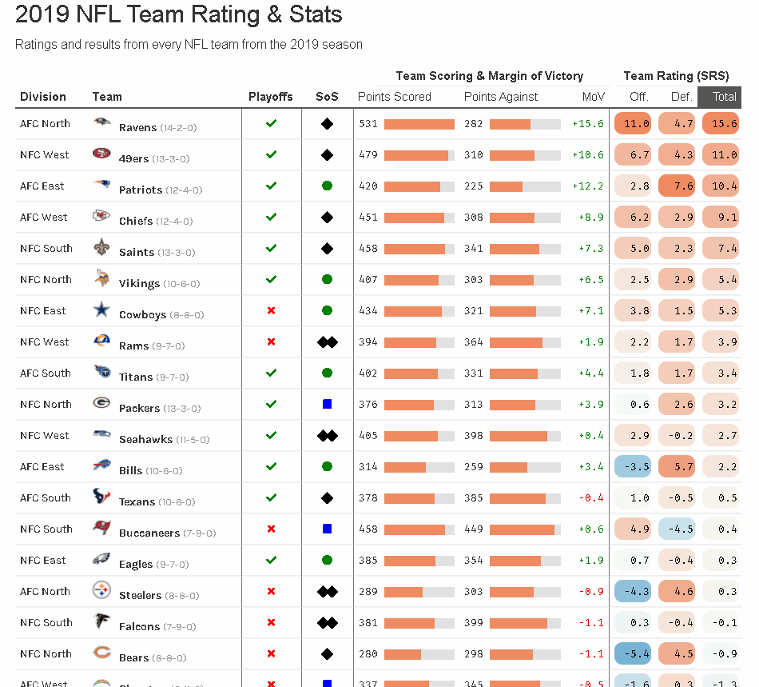

# 2019 NFL Team Ratings

Link: https://rpubs.com/kcuilla/nfl_team_ratings

Interactive table created with the `reactable` package displaying the team ratings and stats of every NFL team from the 2019 season.

Data is sourced from Pro-Football-Reference.com.

## Column Definitions

- SRS (Simple Rating System) is a rating based on point differential and strength of schedule. An SRS rating of 0.0 is average.
- SoS (Strength of Schedule) is the combined winning pct of the teams that each team played. For this table, I converted this into icons following the ski trail difficulty rating system to represent easy, moderate, difficult, and very difficult schedules
- MoV is the average margin of victory for each game the team played

# Interactive Demo:

# Table sorted by Total Team Rating:

# Table sorted by Division:

